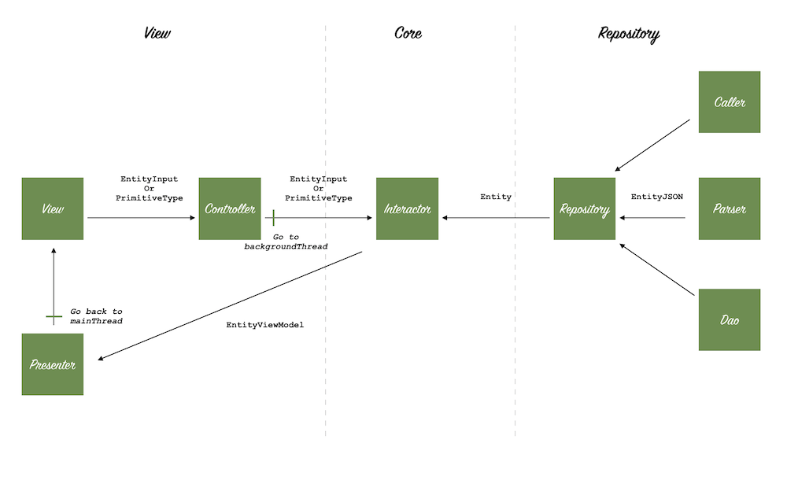
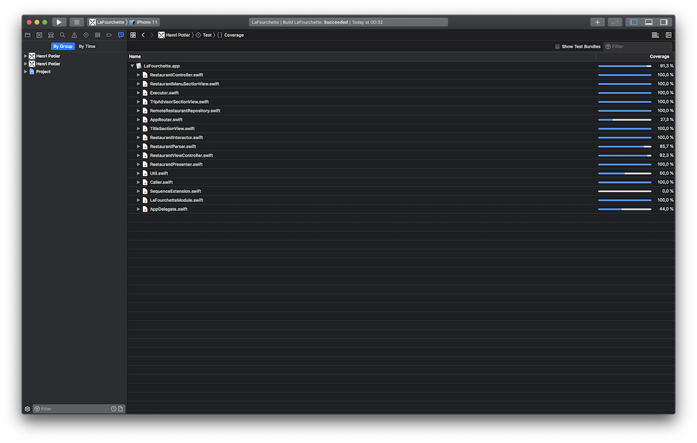
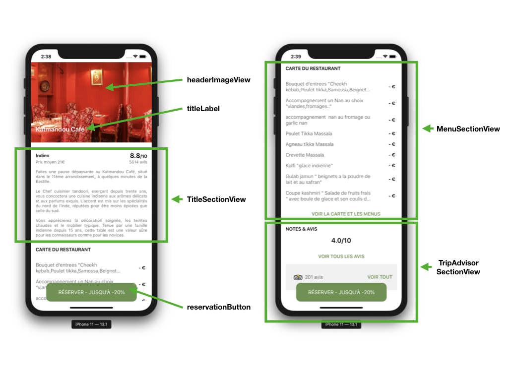
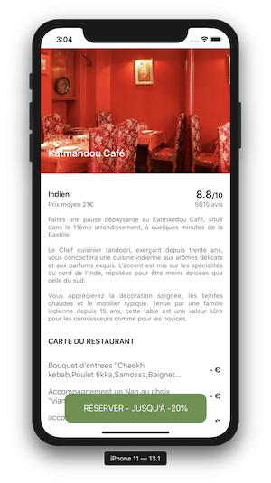
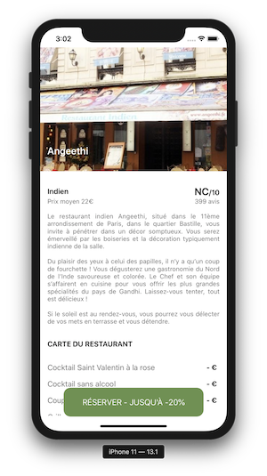
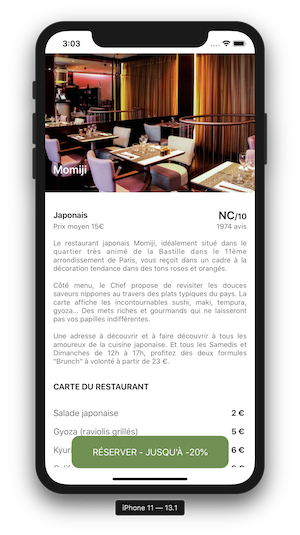
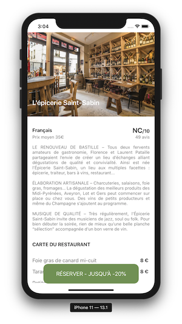
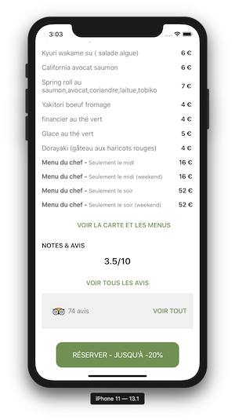

# iOS Practical Case: Restaurant Card

The first goal of this test is to build an iOS App with an Architecture adapted to the test,
compatible with **iOS 9.0** and written in **Swift**, **without Xib and Storyboard.**
But also to show your strengths and motivation to work for a growing innovative company. It
is therefore important to focus your work on specific points (usually those where you are
most comfortable):

- Architecture
- Unit Testing
- Quality of your code
- Maintainability of your code
- Respect of Swift principles

###Tips:

- Restaurant data can be retrieved via TheFork public API
- Data for other restaurants can be accessed using different id_restaurant like
40370, 16409, 14163.
- Respect as much as possible the proposed design
- The test is feasible in 4 hours, but of course you can spend more time.
- You can add a README to your project to explain us your choices and your feeling
about this test.

The iOS team will review your code and if you succeed, you will meet it to do a CodeReview.
It will be the occasion to defend your choice and justify yourself with perhaps your future
colleagues.

####Good luck!

### FROM HERE I PRESENT MY WORK

## Architecture
I choose to use a clean archicture to design this application.

This architecure is very modular and enables me to test only "critical" components like `Controller`, `Interactor`, `Repository`, `Presenter`.

## Gains
What a great challenge to code all the UI with no xib and no storyboard! We need to rethink the way we see our layouts. I composed with sections during this exercice as you can see below.

I used `UIStackView` to get language text-inversed position (arabic, chinese,...) for free (because UIStackView handles it for me). Like in the meals or in the menus of the restaurant.

I used an extension to localized my Strings

I used `Layout Anchors` APIs for apply the constraints

## Improvements
I could have:

- Use `CodingKeys` to compose my RestaurantJSON with more convenient names
- Add unit test in RestaurantParser to work with a mock json file and test the real parsing

## Screenshots

#QA
You have init your constraints in `didMoveToSuperView`. Do you think there is side effect if `removeFromSuperview`is called ?

When `removeFromSuperview` iOS keep constraints inside child view. Only parents constraints are destroyed. If you init parent constraints again the UI elements inside child view appeared correctly.